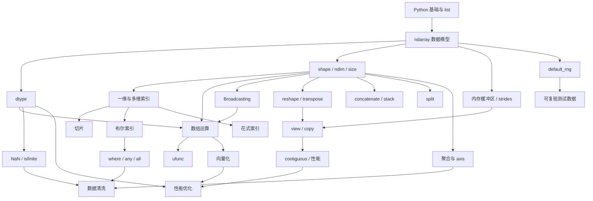
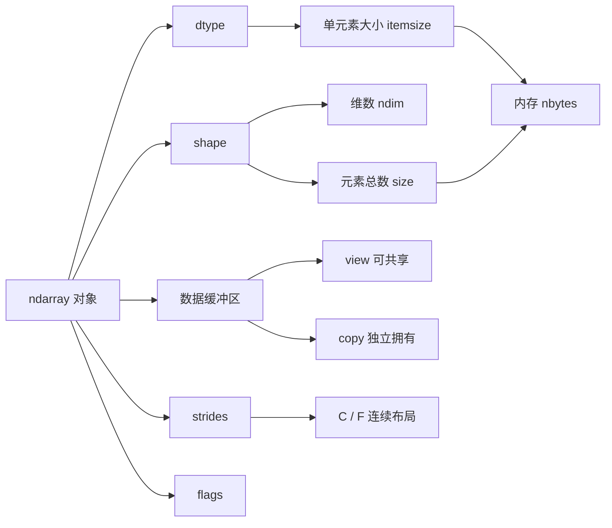
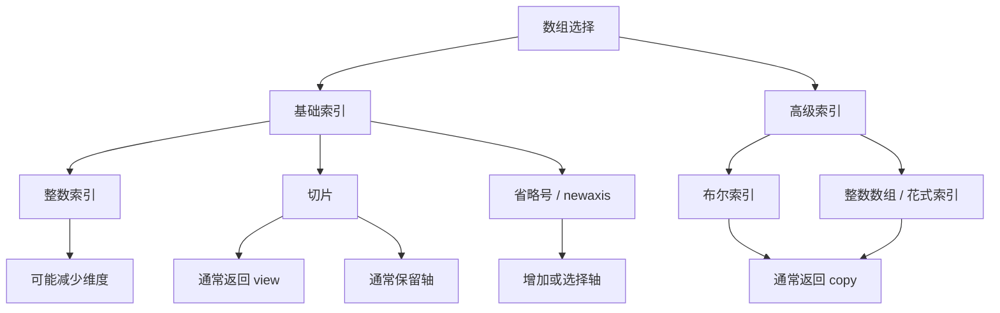
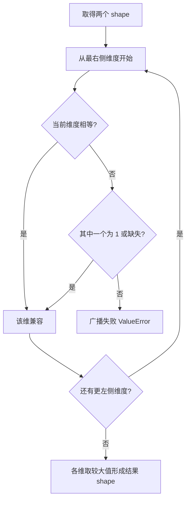
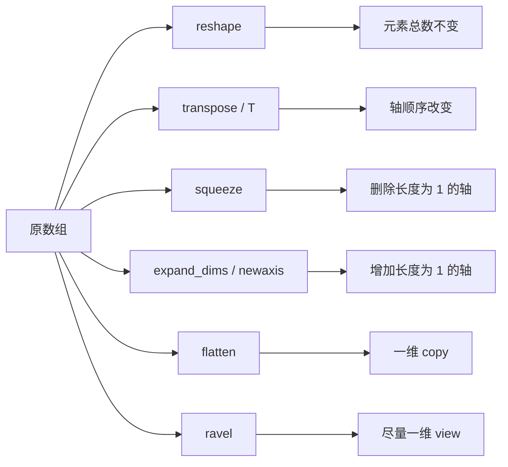

# NumPy 知识图谱

## 总体依赖图



## ndarray 对象模型



## 索引知识图谱



## Broadcasting 判断图



## shape 变换图谱



## axis 与聚合关系

```text
二维数组 shape = (rows, columns)

                    columns 轴 axis=1
                  ───────────────────→
rows 轴 axis=0    [ a00  a01  a02 ]
       │           [ a10  a11  a12 ]
       │           [ a20  a21  a22 ]
       ▼

沿 axis=0 聚合：折叠 rows，得到每列结果，shape=(columns,)
沿 axis=1 聚合：折叠 columns，得到每行结果，shape=(rows,)
```

## 核心机制与常见错误映射

| 机制 | 必须掌握 | 常见错误 |
|---|---|---|
| dtype | 范围、精度、类型提升、内存 | 整数溢出、浮点直接相等、混合类型字符串化 |
| shape | 维度含义、结果 shape 推理 | 只看元素数量、不看逐轴结构 |
| 索引 | 基础与高级索引差异 | 行列写反、整数索引意外降维 |
| broadcasting | 从右向左逐轴判断 | 把 size 相同误认为可广播 |
| axis | 被折叠的轴 | 机械背“行/列”导致三维时失效 |
| view/copy | 数据是否共享 | 修改切片污染原数组，或到处复制浪费内存 |
| NaN | 专用检查函数 | `arr == np.nan` 永远找不到 NaN |
| 向量化 | 数组表达整个计算 | 把 `np.vectorize` 当性能优化，制造大临时数组 |
| 随机数 | 独立 Generator | 库函数修改全局 seed，测试相互影响 |

## 学习依赖清单

```text
必须先会 ndarray / shape
    才能学习多维索引、axis、reshape、broadcasting

必须先会 dtype
    才能理解 NaN、精度、溢出、内存和性能

必须先会索引与 shape
    才能理解 view/copy、合并拆分和高级选择

必须先会 broadcasting + axis
    才能独立完成标准化、批量统计和特征运算

必须先会 view/copy + dtype
    才能进行可靠的内存与性能优化
```
