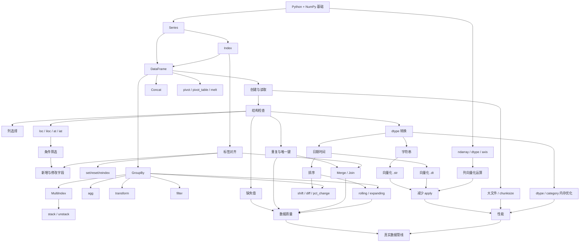
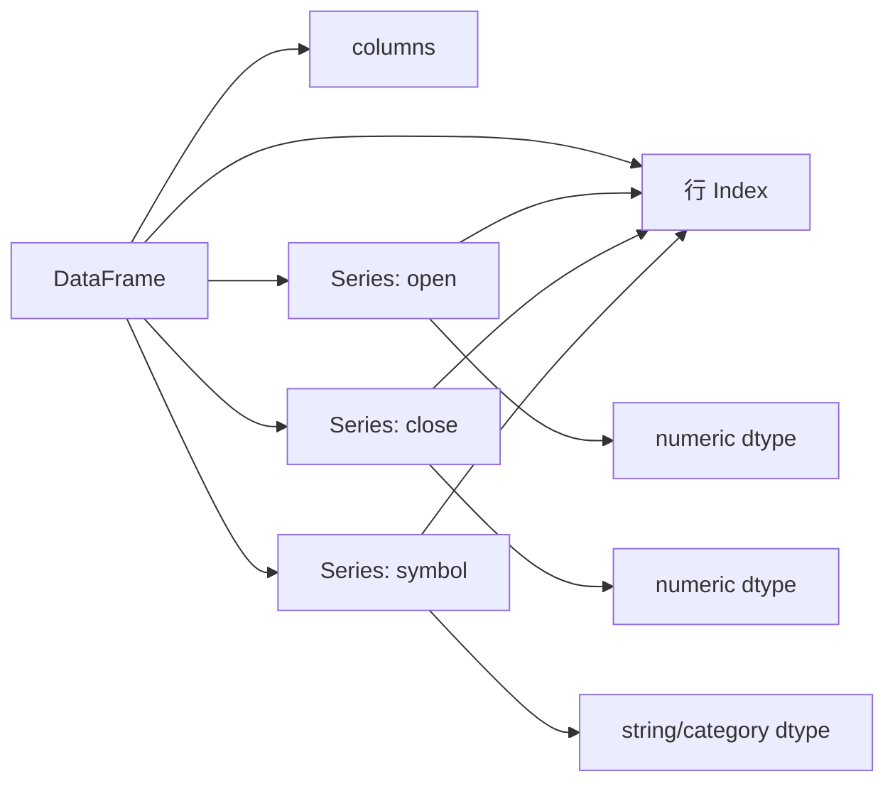
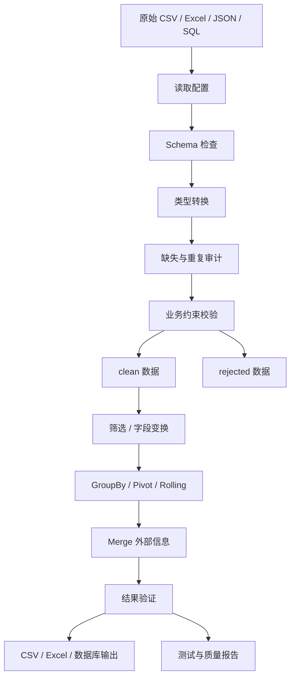
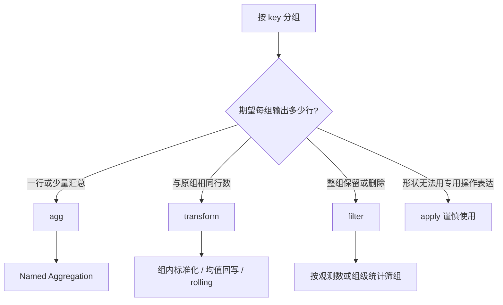
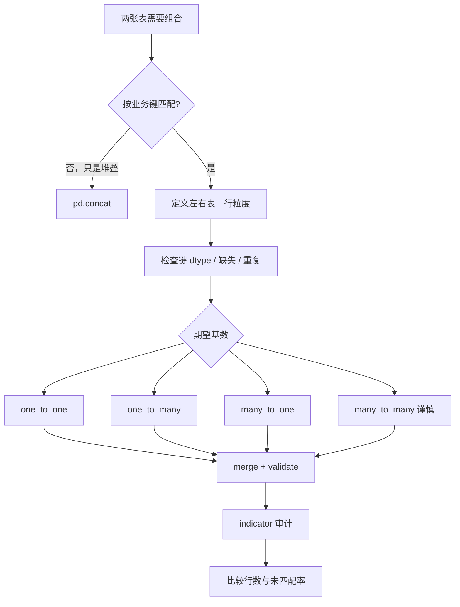
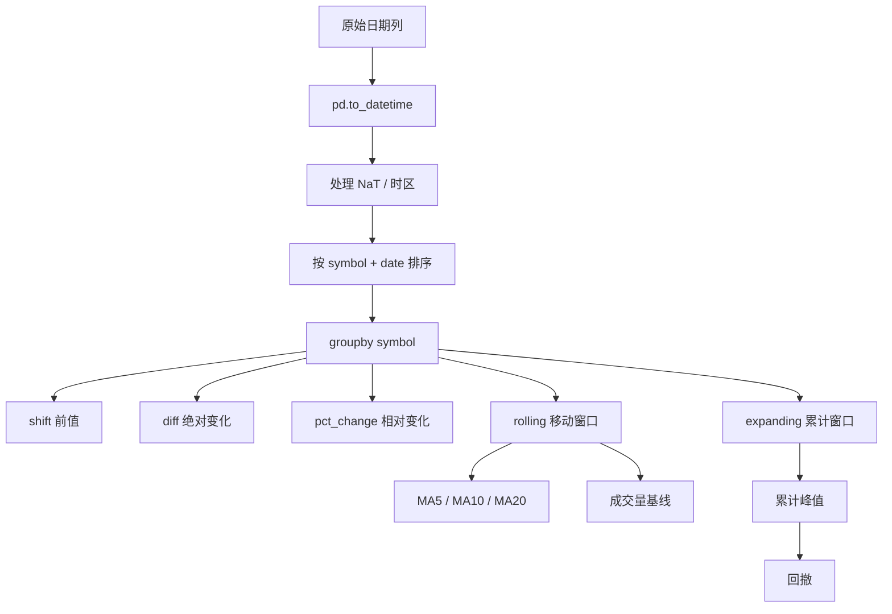

# Pandas 知识图谱

## 总体依赖图



## Pandas 对象关系



## 数据处理主流程



## 数据选择图谱

```mermaid
flowchart TD
    A[我要选择什么?] --> B{列?}
    B -- 单列 --> C[df['col'] -> Series]
    B -- 多列 --> D[df[['a','b']] -> DataFrame]
    B -- 行与列 --> E{依据是什么?}
    E -- 标签 --> F[loc]
    E -- 整数位置 --> G[iloc]
    E -- 单个标签标量 --> H[at]
    E -- 单个位置标量 --> I[iat]
    E -- 条件 --> J[构造布尔 mask]
    J --> K[df.loc[mask, columns]]
```

## GroupBy 粒度图谱



## Merge 决策图



## 时间序列依赖图



## 错误与根因映射

| 表现 | 优先检查 | 常见根因 |
|---|---|---|
| `KeyError` | `columns` / `index` 的 `repr` | 拼写、空格、大小写、错误轴、层级标签 |
| `IndexError` | `shape` 与 `iloc` 位置 | 筛选后行数减少、位置越界 |
| `ValueError` | dtype、shape、mask、赋值长度 | 类型转换失败、真值含糊、广播/对齐错误 |
| SettingWithCopy | 赋值目标所有权 | 链式索引、切片与副本意图不明确 |
| merge 行数膨胀 | 两侧键重复和基数 | 多对多组合 |
| rolling 结果异常 | 排序和分组边界 | 未排序、跨股票窗口、未来数据泄漏 |
| 结果大量 NaN | Index 与键对齐 | 标签不一致、reindex、merge 未匹配、类型不一致 |
| 内存过高 | object、无关列、复制 | 未设置 usecols/dtype、循环 concat、过度 copy |

## 学习依赖清单

```text
Series / DataFrame / Index
    是选择、对齐和所有高级操作的基础

数据检查 + dtype + 缺失 + 唯一键
    是可靠 GroupBy、Merge、时间序列的前提

一行粒度 + 分组思想
    决定 agg / transform / filter 的正确选择

Index 对齐 + 键基数
    决定赋值和 Merge 是否安全

datetime + 排序 + groupby
    决定 rolling / shift / pct_change 是否正确

向量化 + dtype + 分块
    共同决定性能，而不是单靠 apply 或一个参数
```
