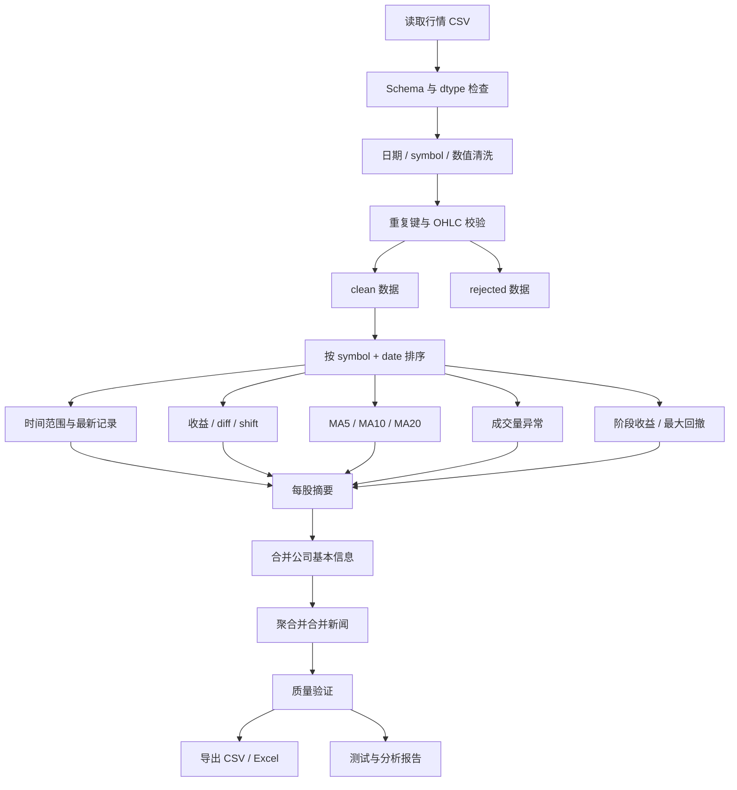

# 股票数据综合实战

> 本项目用于 NumPy / Pandas 编程训练，不构成投资建议。

## 一、统一数据结构

行情表至少包含：

```text
date
symbol
open
high
low
close
volume
```

### 数据字典

| 字段 | 建议 dtype | 含义 | 主要校验 |
|---|---|---|---|
| `date` | datetime64 | 交易日期/时间 | 可解析、时区明确、不过度超前 |
| `symbol` | string/category | 股票代码 | 去空格、统一大小写、非空 |
| `open` | float | 开盘价 | 正数、不高于 high、不低于 low |
| `high` | float | 最高价 | 不低于 open/close/low |
| `low` | float | 最低价 | 不高于 open/close/high |
| `close` | float | 收盘价 | 正数、不高于 high、不低于 low |
| `volume` | nullable integer/float | 成交量 | 非负，缺失含义明确 |

通常的业务唯一键是：

```text
date + symbol
```

真实市场还需要明确：

- 前复权、后复权还是不复权。
- 价格和成交量单位。
- 日期还是精确时间戳。
- 时区。
- 交易日历。
- 停牌和缺失记录的区别。

## 二、项目总体流程



## 三、任务 1：读取与数据体检

### 要求

1. 只读取需要的列。
2. 使用 `parse_dates` 或读取后显式 `to_datetime`。
3. 数值列使用 `to_numeric(errors="coerce")` 并保留失败证据。
4. 输出行列数、日期范围、股票数、缺失计数、重复键计数。
5. 检查 OHLC 关系。

### 建议函数

```python
def load_quotes(path) -> pd.DataFrame:
    ...

def validate_schema(df: pd.DataFrame) -> None:
    ...

def quality_report(df: pd.DataFrame) -> dict[str, int | float | str]:
    ...
```

### 验收

- 缺列时抛出清晰异常。
- 空文件能明确处理。
- 不静默跳过坏行。
- 质量报告可序列化。

## 四、任务 2：数据清洗

### 要求

- `symbol` 去首尾空格并转大写。
- 日期解析失败记录进入 rejected。
- open/high/low/close/volume 转成数值。
- 非正价格进入 rejected 或按明确规则处理。
- 负成交量进入 rejected。
- date+symbol 重复先审计，再按版本依据去重。
- 返回 clean 与 rejected 两份数据。
- 不修改调用方传入的 DataFrame。

### 推荐接口

```python
def clean_quotes(
    raw: pd.DataFrame,
) -> tuple[pd.DataFrame, pd.DataFrame]:
    ...
```

### 不能做

- 无差别 `fillna(0)`。
- 无记录地 `dropna()`。
- 不排序就 `drop_duplicates(..., keep="last")`。
- 用异常捕获把所有错误吞掉。

## 五、任务 3：时间范围与最新交易日

### 要求

1. 获取某只股票全部数据。
2. 筛选开始和结束日期。
3. 找全市场最新交易日数据。
4. 找每只股票自己的最后一条记录。
5. 计算每只股票距全局最新日的天数。

### 必须区分

```text
全市场最新日期：df["date"].max()

每只股票最新记录：
按 symbol/date 排序后 groupby("symbol").tail(1)
```

停牌股票在全局最新日期可能没有记录，但仍有自己的最后有效记录。

## 六、任务 4：每日涨跌幅

### 要求

```python
df = df.sort_values(["symbol", "date"])
grouped_close = df.groupby("symbol", sort=False)["close"]

df["previous_close"] = grouped_close.shift(1)
df["change"] = grouped_close.diff()
df["return"] = grouped_close.pct_change(fill_method=None)
```

### 验收

- 每只股票第一条收益为缺失。
- 不跨股票比较。
- 前值为 0 时能识别无穷值。
- 缺失前值不被隐式填充。
- 明确 `0.05` 表示 5%。

## 七、任务 5：MA5 / MA10 / MA20

### 要求

```python
for window in (5, 10, 20):
    df[f"ma{window}"] = df.groupby("symbol")["close"].transform(
        lambda values, window=window: values.rolling(
            window,
            min_periods=window,
        ).mean()
    )
```

### 均线关系

```python
has_all_ma = df[["ma5", "ma10", "ma20"]].notna().all(axis=1)

df["bullish_ma"] = (
    has_all_ma
    & (df["ma5"] > df["ma10"])
    & (df["ma10"] > df["ma20"])
)
```

### 验收

- 窗口不会跨股票。
- 数据先按时间排序。
- 窗口不足时保持缺失。
- 不使用 `bfill()` 把未来均线填到过去。
- 循环 lambda 正确固定当前 window。

## 八、任务 6：成交量异常放大

### 基础方案

```python
df["volume_ma20"] = df.groupby("symbol")["volume"].transform(
    lambda values: values.rolling(20, min_periods=10).mean()
)

df["volume_ratio"] = df["volume"] / df["volume_ma20"]
df["volume_spike"] = df["volume_ratio"] >= 2
```

### 进一步思考

- 为什么不能直接比较不同股票的绝对成交量？
- 平均值是否容易受极端值影响？
- 是否使用中位数、分位数或 z-score？
- 当窗口样本不足时如何处理？
- 异常阈值是否应按市场或股票类型调整？

## 九、任务 7：阶段收益与涨跌排名

### 阶段首尾收益

```python
period = df.groupby("symbol", as_index=False).agg(
    first_date=("date", "first"),
    last_date=("date", "last"),
    start_close=("close", "first"),
    end_close=("close", "last"),
    observations=("close", "count"),
)

period["period_return"] = (
    period["end_close"] / period["start_close"] - 1
)
```

### 排名之前必须检查

- 各股票是否覆盖同一开始和结束日期。
- 最小观测数量。
- 停牌和新上市造成的区间差异。
- 是否使用复权价格。
- 是否存在极端错误价格。

### 最大涨幅口径

“最大涨幅”至少可能表示：

1. 区间首尾收益。
2. 单日最大收益。
3. 任意历史低点到后续高点的最大收益。

必须在函数名、说明和测试中明确采用哪一种。不能简单用全局 `max(close) / min(close) - 1` 表示可实现涨幅，因为最大值可能早于最小值。

## 十、任务 8：阶段最大跌幅与最大回撤

### 最大回撤

```python
df["running_peak"] = df.groupby("symbol")["close"].cummax()
df["drawdown"] = df["close"] / df["running_peak"] - 1

max_drawdown = df.groupby("symbol", as_index=False).agg(
    max_drawdown=("drawdown", "min")
)
```

### 必须理解

- 回撤值通常不大于 0。
- 最小值表示最深回撤。
- `cummax` 只使用当前和过去的数据。
- 最大回撤与单日最大跌幅不是一个概念。

## 十一、任务 9：按 symbol 分组与最新价格

### 输出每只股票摘要

建议字段：

```text
symbol
latest_date
latest_close
observations
period_return
max_drawdown
latest_ma5
latest_ma10
latest_ma20
latest_volume_ratio
data_age_days
```

### 推荐流程

1. 明细表先完成逐行指标。
2. 按 `symbol/date` 排序。
3. 使用 `groupby("symbol").tail(1)` 取得最新整行。
4. 独立聚合阶段收益和最大回撤。
5. 用 one-to-one merge 合并摘要。

## 十二、任务 10：处理停牌和缺失值

### 停牌与缺失的区别

- 停牌：某交易日没有该股票记录，属于“整行缺失”。
- 缺失值：记录存在，但某字段没有值。
- 未上市：早期日期没有记录，不应默认填充。
- 数据源错误：本应存在但丢失，需要审计。

### 原则

- 不默认把缺少交易的日期前向填充为真实交易。
- 若为展示构造完整日历，必须增加 `is_observed` 标志。
- 收益计算前明确是否允许跨停牌区间比较。
- volume 缺失不一定等于 0。

## 十三、任务 11：合并股票基本信息

基本信息表可能包含：

```text
symbol
company_name
industry
exchange
currency
```

行情是多行/股票，基本信息通常是一行/股票，因此预期基数是 many-to-one：

```python
enriched = quotes.merge(
    companies,
    on="symbol",
    how="left",
    validate="many_to_one",
    indicator=True,
)
```

验收：

- `companies["symbol"]` 唯一。
- 合并后行情行数不变。
- 未匹配 symbol 有报告。
- symbol dtype 和清洗规则一致。

## 十四、任务 12：合并行情与新闻

新闻表可能是一日一股多条新闻：

```text
published_at
date
symbol
headline
source
```

如果最终结果要求一日一股一行，新闻必须先聚合到相同粒度：

```python
news_daily = news.groupby(
    ["date", "symbol"],
    as_index=False,
).agg(
    news_count=("headline", "size"),
    sources=("source", "nunique"),
)

report = quotes.merge(
    news_daily,
    on=["date", "symbol"],
    how="left",
    validate="one_to_one",
)
```

如果要保留每条新闻，则应明确输出粒度会变成一条行情对应多条新闻，而不是 merge 后再随意去重。

## 十五、任务 13：导出分析结果

### CSV

```python
report.to_csv(
    "output/stock_report.csv",
    index=False,
    encoding="utf-8",
    date_format="%Y-%m-%d",
)
```

### 导出检查

- 列顺序固定。
- 不意外导出 Index。
- 日期格式固定。
- 浮点精度明确。
- 输出目录存在。
- 相同输入重复运行得到相同排序与结果。
- 重新读取输出后关键字段类型和数量可验证。

## 十六、最终独立项目结构

建议自己创建一个独立练习目录：

```text
stock_analysis/
├── README.md
├── requirements.txt
├── data/
│   ├── stock_prices.csv
│   ├── companies.csv
│   └── news.csv
├── output/
├── src/
│   ├── __init__.py
│   ├── load.py
│   ├── clean.py
│   ├── indicators.py
│   ├── analysis.py
│   └── main.py
└── tests/
    ├── test_clean.py
    ├── test_indicators.py
    └── test_analysis.py
```

不要为了分层而过度设计。也可以从一个 `analysis.py` 开始，当职责明显变多时再拆文件。

## 十七、最终验收清单

### 功能

- [ ] 获取某只股票数据
- [ ] 筛选时间范围
- [ ] 找最新交易日数据
- [ ] 计算每日涨跌幅
- [ ] 计算 MA5 / MA10 / MA20
- [ ] 判断均线关系
- [ ] 找成交量异常交易日
- [ ] 计算阶段收益
- [ ] 计算最大回撤
- [ ] 按 symbol 分组
- [ ] 找每只股票最新价格
- [ ] 找阶段涨幅最大的股票
- [ ] 处理停牌和缺失
- [ ] 合并股票基本信息
- [ ] 合并行情与新闻
- [ ] 导出分析结果

### 数据可靠性

- [ ] 必需列检查
- [ ] dtype 检查
- [ ] 日期解析失败审计
- [ ] date + symbol 重复审计
- [ ] OHLC 约束检查
- [ ] merge 基数验证
- [ ] merge 前后行数检查
- [ ] 未匹配键报告
- [ ] 指标不会跨 symbol
- [ ] 不使用未来数据

### 工程质量

- [ ] 核心函数有类型注解
- [ ] 不意外修改输入 DataFrame
- [ ] 函数不依赖 print 才能测试
- [ ] 至少 8 个正常与边界测试
- [ ] 脚本可重复运行
- [ ] README 解释统计口径
- [ ] 输出排序与列顺序稳定
- [ ] 记录一次性能测量

## 十八、闭卷考核制度

### 第一次

- 限时 3 小时。
- 可以查看官方文档。
- 不允许让 AI 生成完整函数。
- AI 只允许回答错误方向或 API 名称。

### 第二次

三天后从空文件重新实现：

- 限时 2 小时。
- 核心 API 不查文档。
- 只保留数据字典和验收清单。

### 第三次

两周后更换一份新股票数据：

- 独立适配新列名、日期格式和缺失模式。
- 增加一个新指标。
- 增加一个新的 merge 数据源。
- 比较两个版本的性能和测试覆盖。

达到第三次仍能独立完成，才算真正掌握，而不是只记住一份答案。
